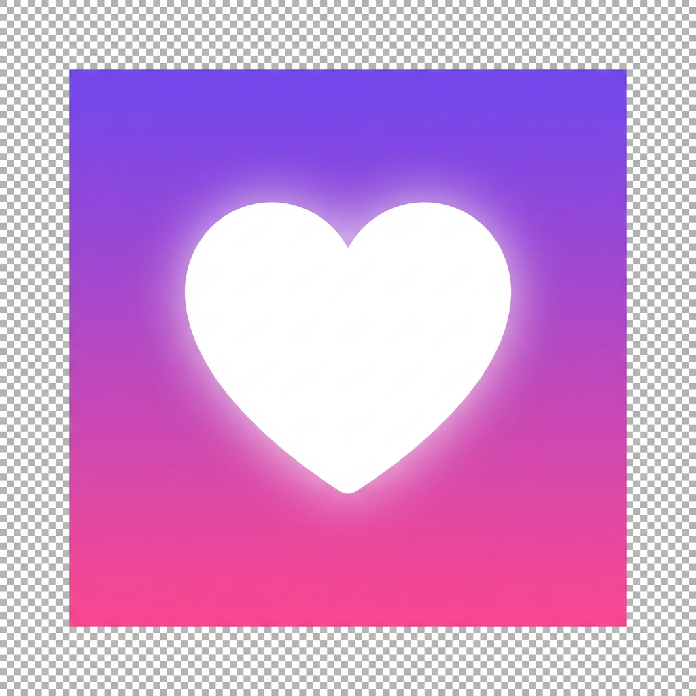

# 💖 CLAUDIA - Registro de Horas

Aplicación web progresiva (PWA) personalizada para el registro de horas de trabajo en Paradores.



## 🌟 Características

- ✅ **Registro de horas** por zona de trabajo
- 📊 **Resumen semanal y mensual** con gráficos visuales
- 🔍 **Filtros personalizados** por período
- 💾 **Almacenamiento local** - tus datos permanecen en tu dispositivo
- 📱 **PWA instalable** - funciona como app nativa
- 🔒 **100% offline** - no requiere conexión a internet
- 💖 **Pantalla de bienvenida romántica** con animaciones

## 🚀 Demo en Vivo

Visita la aplicación: [https://miguel-sgv.github.io/claudia-app/](https://miguel-sgv.github.io/claudia-app/)

## 📱 Instalación

### Como PWA (Recomendado)

**En Android (Chrome):**
1. Abre la app en Chrome
2. Toca "Añadir a pantalla de inicio"
3. ¡Listo! Úsala como app nativa

**En iPhone (Safari):**
1. Abre la app en Safari
2. Toca el botón Compartir (□↑)
3. Selecciona "Añadir a pantalla de inicio"

### Como APK (Android)

Descarga e instala el archivo APK desde [Releases](../../releases)

## 🛠️ Tecnologías

- **HTML5** - Estructura semántica
- **CSS3** - Diseño moderno con gradientes y animaciones
- **JavaScript** - Lógica de la aplicación
- **PWA** - Service Worker para funcionalidad offline
- **LocalStorage** - Persistencia de datos local

## 💻 Desarrollo Local

```bash
# Clonar el repositorio
git clone https://github.com/miguel-sgv/claudia-app.git

# Navegar al directorio
cd claudia-app

# Servir con un servidor local
python -m http.server 8000

# Abrir en el navegador
# http://localhost:8000
```

## 📂 Estructura del Proyecto

```
claudia-app/
├── index.html          # Página principal
├── styles.css          # Estilos de la aplicación
├── app.js             # Lógica principal
├── manifest.json      # Configuración PWA
├── sw.js              # Service Worker (offline)
├── icon-192.png       # Icono 192x192
├── icon-512.png       # Icono 512x512
└── README.md          # Este archivo
```

## 🎨 Características de Diseño

- **Gradientes violeta/rosa** - Tema romántico personalizado
- **Efectos 3D** - Sombras y profundidad en elementos
- **Animaciones suaves** - Transiciones y micro-interacciones
- **Responsive** - Optimizado para móviles
- **Fuentes personalizadas** - Dancing Script y Comic Sans

## 📊 Funcionalidades

### Registro de Horas
- Selección de zona de trabajo
- Fecha y horas de entrada/salida
- Cálculo automático de horas trabajadas

### Visualización
- Lista completa de registros
- Filtros por período (semana, mes, personalizado)
- Resumen semanal con gráficos por zona
- Resumen mensual con estadísticas

### Datos
- Almacenamiento 100% local
- Sin envío a servidores externos
- Privacidad total

## 🔒 Privacidad

- ✅ Todos los datos se guardan localmente en tu dispositivo
- ✅ No se envía información a servidores externos
- ✅ No hay rastreadores ni analytics
- ✅ Código abierto y auditable

## 📝 Licencia

Este proyecto es de uso personal.

## 💖 Creado con Amor

Desarrollado especialmente para Claudia 💕

---

**Versión:** 1.0.0  
**Última actualización:** Diciembre 2024
